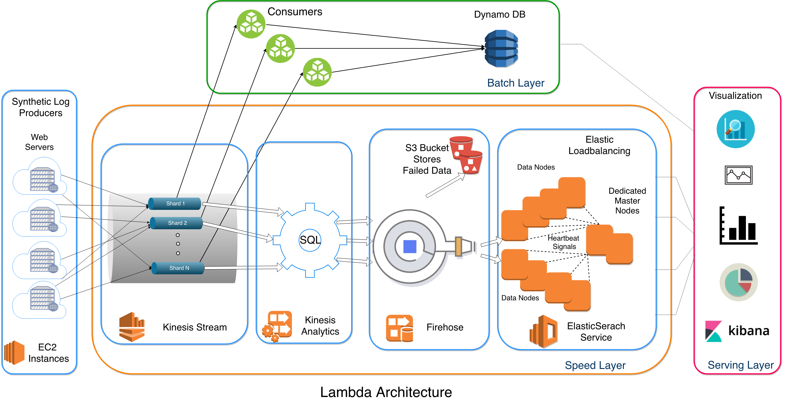

# LiveLogAnalytics
Real-Time Web Server Log Processing    
CSC 591 Data Intensive Computing

## Team: Group 6  
- Daxkumar Amin (dkamin)  
- Khantil Choksi (khchoksi)  
- Riken Shah (rshah9)  

---------------------------------------------------------------------

## Architecture

---------------------------------------------------------------------

## Steps to setup the Kinesis pipeline with DynamoDB  
- Make sure you are in US-WEST-2 AWS Region  
- Create EC2 instance by CloudFormation Template  
- Create DynamoDB to be used by consumers to put data for analysis  
- Producers will use raw data and simulate like high velocity of stream from the dataset  
- Configure the conf.py file depending on your requirements of input and output stream rates and how you want to visualize.  
- Run the script on EC2 instance with Python3 installed.
- Run setup.sh file to install pip3 and dependencies.  
- Producer: `python ./datagenerator/producer.py`
- Consumer: `python ./consumer/consumer.py <shard_id>`
- Also follow this steps: https://aws.amazon.com/blogs/big-data/perform-near-real-time-analytics-on-streaming-data-with-amazon-kinesis-and-amazon-elasticsearch-service/

Screenshots:  
- [Infrastructure](./Screenshot/Screenshot4.png)
- [Producer & Consumer - Kafka](./Screenshot/Screenshot2.png)
- [DynamoDB](./Screenshot/Screenshot1.png)
----------------------------------------------------------------------------------  

## Milestone Project Proposal  
[Click Here to access Project Proposal](./Project_Reports/Group_6_DIC_Project_Proposal.pdf)  

----------------------------------------------------------------------------------  

## Milestone Project Overview (Quad Chart)  
[Click Here to access Project Overview](./Project_Reports/Project_Overview.pdf)    

----------------------------------------------------------------------------------  

## Milestone Project Status Report (Quad Chart)  
[Click Here to access Project Status Report](./Project_Reports/Project_Status_Report.pdf) 

----------------------------------------------------------------------------------

## Final Report & Presentation
- [Final Project Report](./Project_Reports/Group_6_Final_Report.pdf)
- [Presentation](./Project_Reports/Group_6_Final_Presentation.pptx)

----------------------------
### References:   
- Web log data https://www.kaggle.com/shawon10/web-log-dataset
- https://kafka.apache.org/10/javadoc/  
- https://docs.aws.amazon.com/AWSCloudFormation/latest/UserGuide/aws-resource-kinesis-stream.html#aws-resource-kinesis-stream-examples  
- https://kafka-python.readthedocs.io/en/master/apidoc/modules.html      
- https://aws.amazon.com/blogs/big-data/perform-near-real-time-analytics-on-streaming-data-with-amazon-kinesis-and-amazon-elasticsearch-service/  
